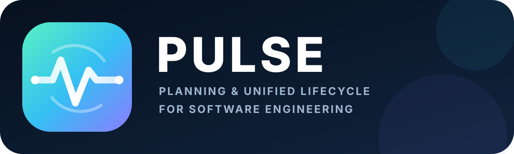

<p align="center">
  <a href="https://manishtiwari25.github.io/pulse/">
    
  </a>
</p>

<p align="center">
  A docs-first, agent-ready framework for carrying software work from context to learning without losing the reasoning in between.
</p>

<p align="center">
  <a href="https://manishtiwari25.github.io/pulse/">Public documentation</a>
  ·
  <a href="docs/prompts/integration-prompts.md">Adopt PULSE with one prompt</a>
  ·
  <a href="docs/README.md">Browse the control plane</a>
</p>

# PULSE

**PULSE** stands for **Planning & Unified Lifecycle for Software Engineering**.

It gives people and coding agents one durable place to understand a repository,
record decisions, plan work, describe behavior, guide implementation, verify
results, and keep useful lessons.

## Why Teams Need PULSE

Large teams rarely use one person or one tool. A feature may begin in a ticket,
be discussed in chat, planned in a document, changed by an IDE agent, and
finished by a different developer. Without a shared system, each person and
tool builds its own private history.

The code usually shows **what** was built, but not:

- Why the feature was implemented that way.
- Which other options were considered and rejected.
- Which constraint, incident, or user need shaped the decision.
- Whether the implementation still matches the original plan.
- Who verified the result and what was learned afterward.

PULSE keeps a repository-native audit trail and decision tree:

```text
Context -> Options -> Decision -> Plan -> Feature -> Code -> Verification -> Learning
```

This gives every developer and tool the same source of truth. New team members
can trace a feature back to its reasons, reviewers can audit the path, and
future agents can continue the work without rebuilding the story from memory.
PULSE does not replace tickets, chat, or planning tools; it keeps the durable
engineering truth beside the code.

## The PULSE Lifecycle

1. **Understand** - read the product, stack, architecture, and current state.
2. **Decide** - record important choices and their tradeoffs as ADRs.
3. **Plan** - turn outcomes into ordered, verifiable work.
4. **Specify** - describe the behavior users and systems should get.
5. **Build, verify, and recover** - run real checks and use the prepared
   rollback plan when a change cannot be made safe.
6. **Learn** - keep durable patterns, rules, and mistakes for the next cycle.

## Agent-Driven Rollbacks

Every PULSE task that changes files or system state prepares a safe way back
before the first edit.

1. **Capture the baseline** - record the starting Git, dependency, deployment,
   and data state that matters.
2. **Name the trigger** - define the failed check, regression, or unsafe
   condition that requires recovery.
3. **Reverse narrowly** - undo only the current task's changes while preserving
   all pre-existing user work.
4. **Verify recovery** - prove the known-good behavior is restored and record
   the result.

Agents can drive routine local rollbacks when their changes are isolated.
Shared history uses an authorized revert commit. Production, migrations, and
data recovery follow tested runbooks and approval boundaries. PULSE never
treats broad resets, force-pushes, or unplanned deletion as a valid rollback.

See the [agent-driven rollback feature](docs/features/001-agent-driven-rollbacks.md)
and [canonical rollback workflow](docs/workflows/rollback.md).

## Fastest Setup

Open any new or existing repository in an AI coding agent, copy the
[PULSE bootstrap prompt](docs/prompts/integration-prompts.md), and approve the
proposed documentation changes.

The agent reads this public repository, preserves the target repository's code
and rules, and safely creates or merges the PULSE control plane. No package,
service, hidden state folder, or model-specific runtime is required.

## What PULSE Provides

- A canonical `docs/` control plane for context, architecture, decisions,
  features, plans, prompts, workflows, memory, and token usage.
- Agent entry points that route work through the same lifecycle.
- Reusable templates for decisions, feature specs, plans, memory, and prompts.
- Portable Agent Skills for bootstrap, planning, decisions, features,
  rollback, review, memory, and delegation advice.
- A safe bootstrap path for both new and established repositories.
- Mandatory rollback plans and scoped agent-driven recovery.
- Token-only work accounting based on the real usage a runner exposes.
- A public documentation site served directly from `docs/`.

## Portable Agent Skills

Install every PULSE skill for GitHub Copilot:

```bash
gh skill install manishtiwari25/pulse --all \
  --agent github-copilot \
  --scope user
```

Install one skill:

```bash
gh skill install manishtiwari25/pulse pulse-rollback \
  --agent github-copilot \
  --scope user
```

The skill pack includes planning, decisions, feature delivery, rollback,
review, memory, bootstrap, and a token-aware delegation advisor.

### Token-Aware Delegation Advisor

`pulse-delegation-advisor` reads the repository's real token ledger, predicts
a lower/central/upper range, reports confidence, and recommends:

- **Agent-led** for clear, reversible, low/medium-risk work.
- **Hybrid** for broad, novel, ambiguous, or weakly predicted work.
- **Human-led** for critical or hard-to-reverse production/data work.

It only says which option is cheaper in money when the user supplies human
time/rate and agent token rate. It never guesses provider pricing or stores
financial values in the usage ledger.

See [`docs/skills/`](docs/skills/README.md) for installation and usage.

## Repository Map

```text
AGENTS.md                         Primary PULSE operating guide
CLAUDE.md                         Claude-specific entry point
.github/copilot-instructions.md   GitHub Copilot entry point
docs/index.html                   Public PULSE documentation site
docs/architecture/                System shape and boundaries
docs/context/                     Product and stack context
docs/decisions/                   Architecture decision records
docs/features/                    Product behavior specifications
docs/guides/                      Adoption and integration guides
docs/memory/                      Durable patterns, rules, and lessons
docs/plans/                       Verifiable work plans
docs/prompts/                     Reusable execution prompts
docs/scripts/                     Token-usage collectors
docs/skills/                      Portable Agent Skills and helpers
docs/usage/                       Per-session token ledger
docs/workflows/                   Repeatable engineering procedures
```

## Manual Adoption

1. Follow the [new repository guide](docs/guides/new-repo.md) or the
   [existing repository guide](docs/guides/integration-existing.md).
2. Adapt `docs/context/product.md`, `docs/context/stack.md`, and
   `docs/architecture/overview.md` to the real repository.
3. Record the first important choice in `docs/decisions/`.
4. Define the first outcome in `docs/features/` and `docs/plans/`.
5. Add or change product code only after the repository's real direction and
   verification path are clear.

PULSE is intentionally model-agnostic and product-code-free. Repositories that
adopt it keep their own stack, source layout, tooling, and delivery process.
